## Identity
* Full name: Shulkergang
* abbreviation: SG

## Discord
* https://discord.gg/eATbWpG2RA

## Founding information
* Founding date: 6 October 2022
* Founded by: 
  * [28st](../Players/28st.md)
  * kokos_odpadnem
  * schmiddie
* Founding Story:
> [28st](../Players/28st.md) met Kokos in a server made by Laggang, Kokos teached [28st](../Players/28st.md) how to dupe , kokos handed him kits and [28st](../Players/28st.md) joined his clan, kokos and [28st](../Players/28st.md) talked alot and somehow [28st](../Players/28st.md) asked kokos for his account password and kokos gave it and they trusted eachother, Then Kokos made Schmiddie meet [28st](../Players/28st.md), [28st](../Players/28st.md) offered to make Shulkergang because it was famous to wear Shulkers with the command /head.

## Acomplishments
- Massive Maparts
- Massive builds / bases
- Became one of the most Notable clans on 6b6t

## Bases
**1.12.2**:
- Shulker 1
- Shulker 2

**1.19**:
- Spaceship
- Mapart
- Space Shulk

## Notable Members
- [[28st](../Players/28st.md)](../Players/[28st](../Players/28st.md).md) (Founder)
- kokos (Founder)
- schmiddie (Founder)
- [CapyKing10](../Players/Less%20Relevant%20Players/capy.md) (Leader)
- [myniany](../Players/myniany.md) (Leader)
- lil__perp (leader)
- ByroBuff (leader)
- aodrael (leader)
- [scarthebest1943](../Players/scar.md) (leader)
- [xiNxghtMar3ix](../Players/nxght.md) (Leader)
- Price (Co Leader)
- Backup_Inventory (Mod)
- Rozen (Mod)
- audsis (higher member)
- vined (higher member)
- femboy (higher member)
- jajo341 (member)
- wiesiupvp (member)
- c1yd3i (member)
- TheJTnoob (member)
- TheTroll2001 (THE chatter)

## Downfall of 1.12.2 Shulkergang
> The Downfall of 1.12.2 Shulkergang started when Shulkergang 2 was constructed. Thats when [28st](../Players/28st.md) decided to make a vote to get a new leader in Shulkergang. the options were Price and lil__perp. He also mentioned that the loser would be co-leader. liL__perp won the vote, making price the new co-leader. For an unknown reason it turned out lil perp and schmiddie made an agreement to kicking kokos_udpadnem for a unknown reason. When they asked [28st](../Players/28st.md) to kick kokos from the group, he wanted to find a peaceful way to fix this. Then lil__perp, audsis, wiesiupvp and vined made a group, then they nuked shulkergang which was 900 members at the time, resulting it in dying.

## Downfall of 1.19 Shulkergang
> 10/20/23: [28st](../Players/28st.md) kicks bd71legend one of the leaders of sg blaming him for making everyone a enemy of shulkergang and using the members for his own sake. After that [28st](../Players/28st.md) appointed two new leaders: [scar](../Players/scar.md) and aodrael.
> This lead a conflict between bd71legend and sg which was started from mid October 2023 to mid January of 2024. 
> During this period shulkergang achieved peak activity in months and constructed two bases. 
> On the other side scar being an anti-imperial made imperials 6b6t to join hands with bd71legend. 
> Together bd71legend and the imps started a long search to find the two builds. 
> 26 October 2023 they achieved success when they found the trail base through some insiders.
> The base was griefed by bd71legend, tanish and dev.
> This caused a counter in which shulker gang greifed another imperial base, which motivated the search. 
> Bd71legend used one of his old accounts Itz_noobri as a bot to fly around a used stash finders to log places.
> The Itz_noobri account was stationed at the shulkergang spaceship base which was constructed by bd71legend and kempercongos (6tools6builders).
> [28st](../Players/28st.md) made a crucial mistake by constructing the base near the old bases.
> On 26th November the account logged a huge stash which after inspection was found to be the main base.
> Bd71legend after finding the base did not greif it or leak the cords and demanded his position of sg leader back.
>This was provided to him but aodreal one of the other leaders managed to kick him which resulted in Protest, adr14n0, bd71legend  and some other crucial members of imps to grief the base on the 6th of December 2023.
> This incident was the final blow in the history of shulkergang as after this grief the leaders started getting inactive resulting in the clan being dead.
> Some members started moving to different servers like [alacity](../MCServers/alacity.md) and some joined donfuer 6b6t.

## Resurrection
> 2 months after bd71legend and the imperials griefed the main bases, [CapyKing10](../Players/Less%20Relevant%20Players/capy.md) and [xiNxghtMar3ix](../Players/nxght.md) which are both leaders in Shulkergang on 6b6t and ToyotaT100 on [8b8t](../MCServers/8b8t.md) contacted the members and other leaders of the two groups about making a new group on [alacity](../MCServers/alacity.md) and set up a groupchat. In that groupchat they decided that they were gonna take element from each group and implement them into the new group.

> SG X TY was the first name of the group, the names were seperated (SG standing for shulkergang and TY for toyota). After aodrael suddenly deleted the discord a new one was made by [xiNxghtMar3ix](../Players/nxght.md) which was called TSG (Toyota Shulkergang). From then on the name stood and TSG went on to became one of the most know groups on [alacity](../MCServers/alacity.md). 

## Logo / Banner
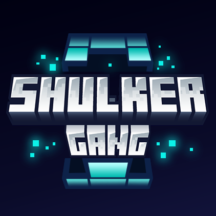

## Gallery
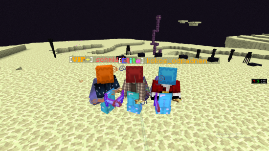

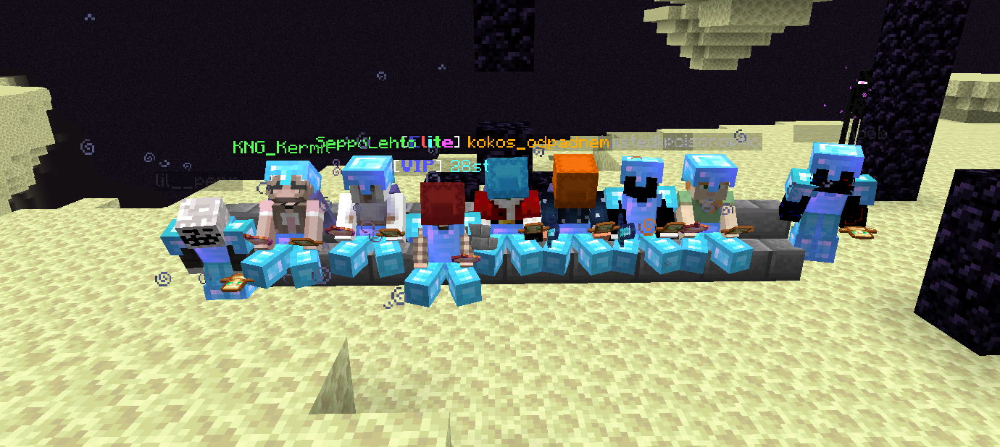

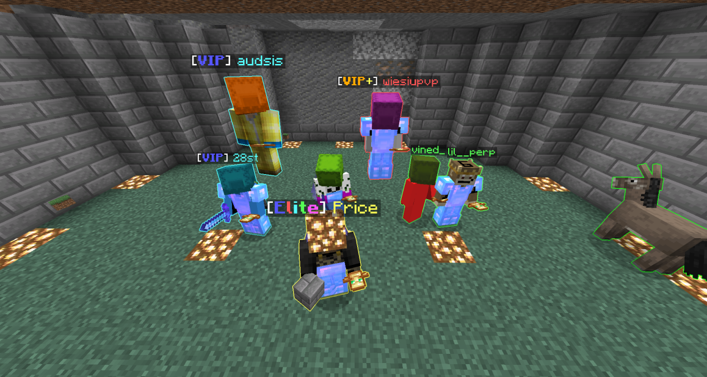

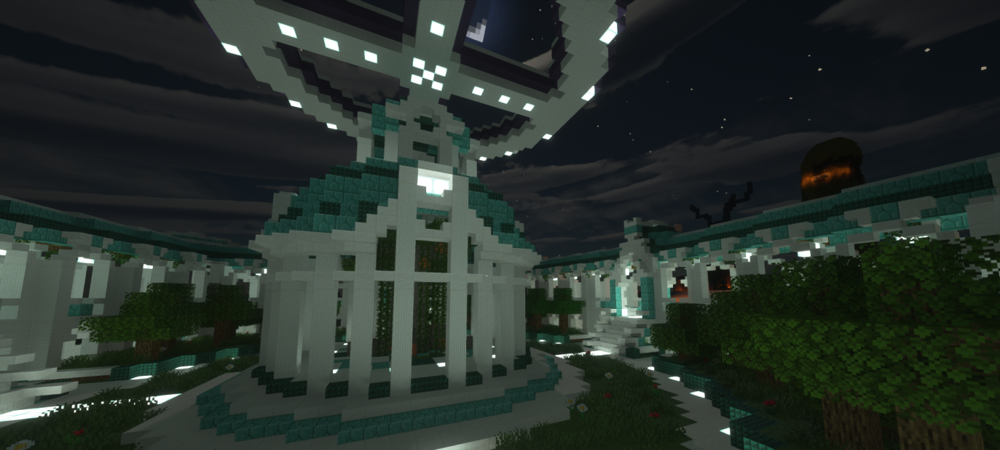

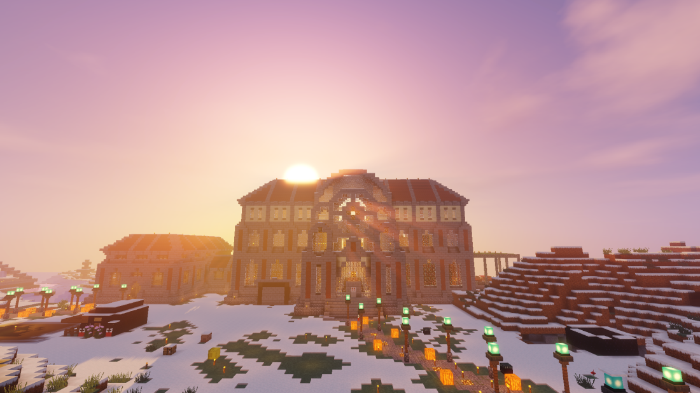

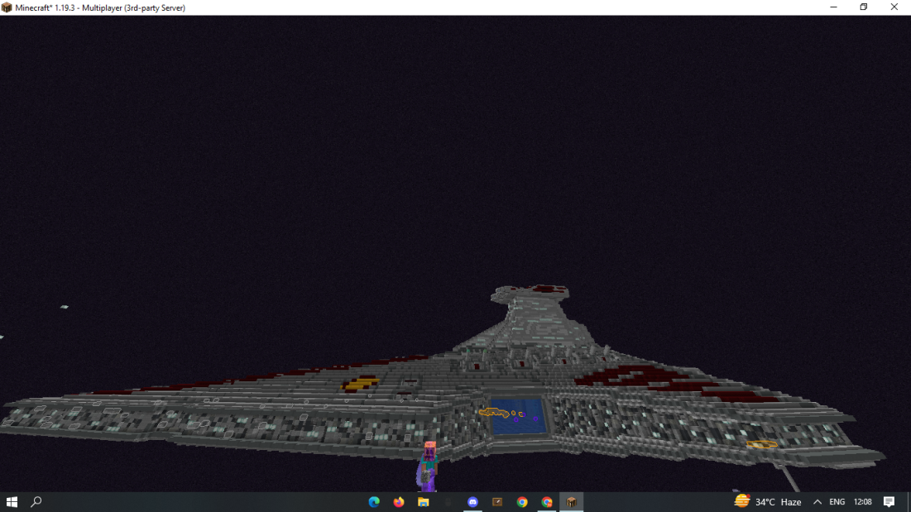

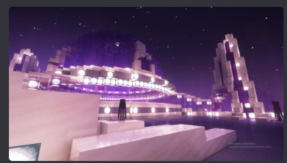

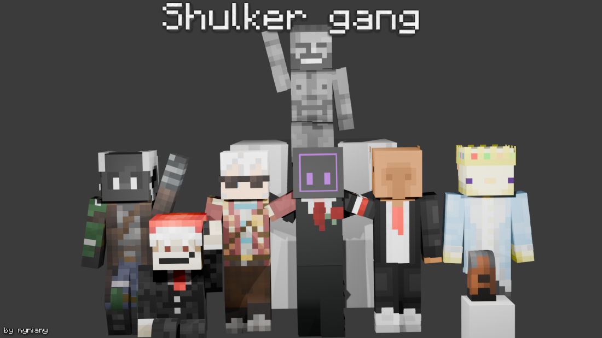

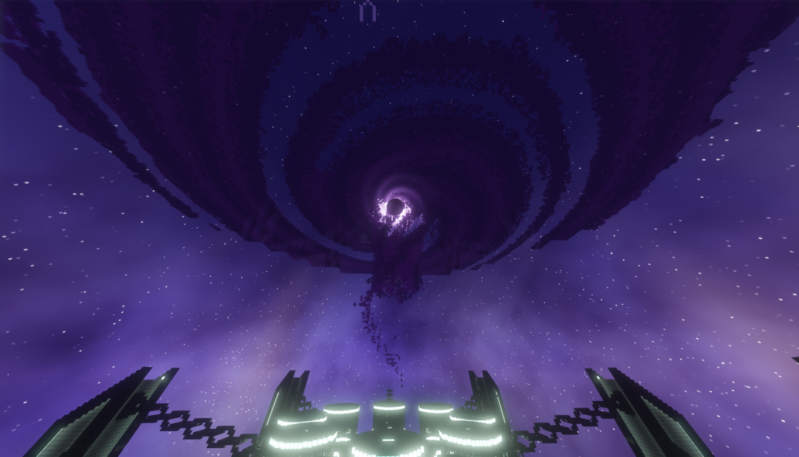

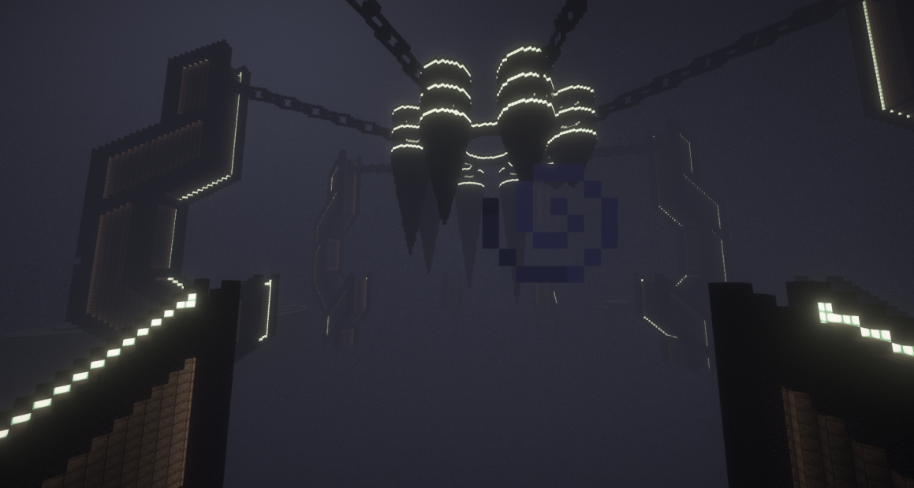

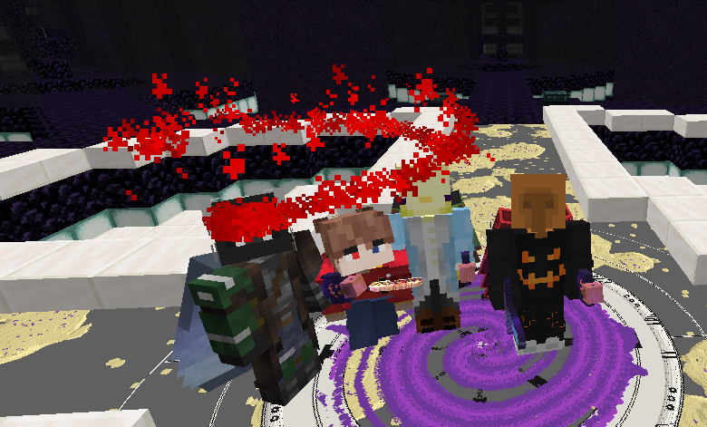
